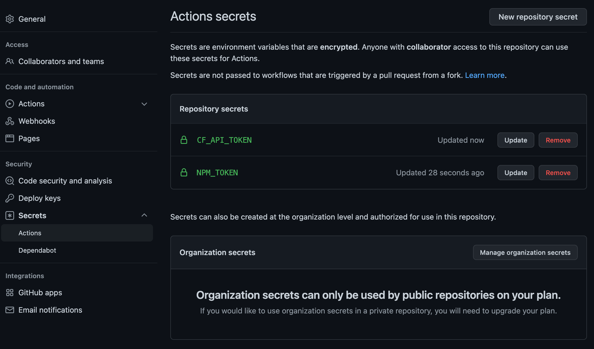

This is a template for making a client-side react static website with a GraphQL backend, hosted on Cloudflare workers.

This project is a good base, if you don't need SEO and need a little backend data.

Demo site is published [here](https://template-vite-cf.gummicube.workers.dev)

### features

- fast local dev
- deploys fast to cloudflare in Github action
- Use privately-hosted npm repos (from Github)
- extremely fast & cheap CF backend hosting
- built-in playground for looking at GraphQL server, locally, and on-site
- looks pretty fresh with mantine
- user-choice for dark-mode is considered, but can be overriden by user

### setup

Press the "Use This Template" button. Add some Settings/Secrets/Actions/Repository secrets to the Github project, for the following:

```sh
NPM_TOKEN="<YOURS>"
CF_API_TOKEN="<YOURS"
```

- `NPM_TOKEN` is a minimal [personal access token](https://github.com/settings/tokens) that can `read:packages`. If you need to publish to npm, also set `write:packages`. You can skip this, if you don't use private packages.
- `CF_API_TOKEN` is a minimal [cloudflare token](https://dash.cloudflare.com/profile/api-tokens) that can edit workers/pages/kv/etc.



Eventually we won't need to do this step, once we have a paid account, and can use org-wide secrets.

For local dev, you can put any variables you want in `.env`, prefixed with `VITE_` and it will be exposed to the frotnend (so no API secrets):

```sh
VITE_NAME="My Sick Website" # this is exposed on client-side website
SOME_OTHER_VAR="this will only be seen on backend" # this is only usable on server-side
```

Make sure to also send them to Cloudflare with `wrangler secret push SOME_OTHER_VAR`.

You can read more about this for [vite](https://vitejs.dev/guide/env-and-mode.html#env-variables) and [cloudflare](https://developers.cloudflare.com/workers/platform/environment-variables/).

#### npm

> **NOTE**: remove this, if you aren't using private NPM packages.

It uses some private `@gummicube` modules, so if you haven't set that up, go read how at [our registry](https://github.com/orgs/Gummicube/packages).

Use this to setup @gummicube packages:

```
npm login --scope=@gummicube --registry=https://npm.pkg.github.com
```

Use your github username & [a personal-access-token](https://github.com/settings/tokens) as the password.
